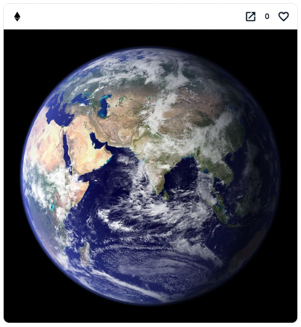
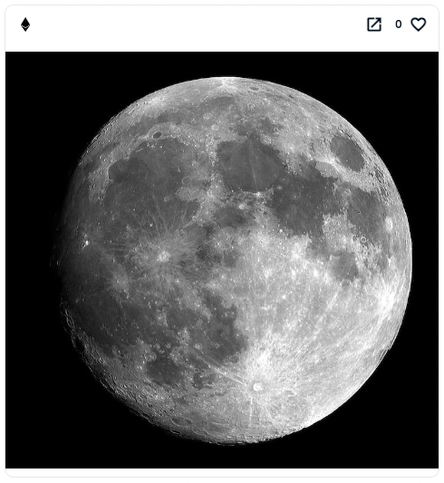

# EthFS Examples

Examples of simple fully on-chain image NFT using [EthFS](https://github.com/holic/ethfs).

## Example1



[OpenSea](https://testnets.opensea.io/ja/assets/goerli/0xc51c10d8f0548a21c6beca6560bb73188b5ff384/1)  
[Etherscan](https://goerli.etherscan.io/address/0xc51c10d8f0548a21c6beca6560bb73188b5ff384#code)

`earth.jpg` was uploaded from [goerli.ethfs.xyz](https://goerli.ethfs.xyz/).
It's Base64 encoded.

## Example2 (Moon)



[OpenSea](https://testnets.opensea.io/ja/assets/goerli/0x1a45dcd1adf527c83395d62d278a804955897b70/1)  
[Etherscan](https://goerli.etherscan.io/address/0x1a45dCd1aDF527C83395D62d278A804955897b70#code)

`moon.jpg` was uploaded using the script below. It's not Base64 encoded.

## Setup

```shell
git clone https://github.com/NowAndNawoo/ethfs-examples.git
cd ethfs-examples
npm i
cp .env.sample .env
```

## Scripts

- `npx hardhat run scripts/uploadFile.ts --network goerli`
  - Upload `moon.jpg` to EthFS
- `npx hardhat run scripts/Example1/deploy.ts --network goerli`
  - Deploy Example1 contract
- `npx hardhat run scripts/Example2/deploy.ts --network goerli`
  - Deploy Example2 contract

## Links

- EthFS
  - [GitHub](https://github.com/holic/ethfs)
  - [Frontend (mainnet)](https://ethfs.xyz/)
  - [Frontend (goerli)](https://goerli.ethfs.xyz/)
- CC0 Photos
  - [Earth](https://www.pexels.com/photo/earth-wallpaper-41953/)
  - [Moon](https://www.pexels.com/photo/photo-of-moon-47367/)
